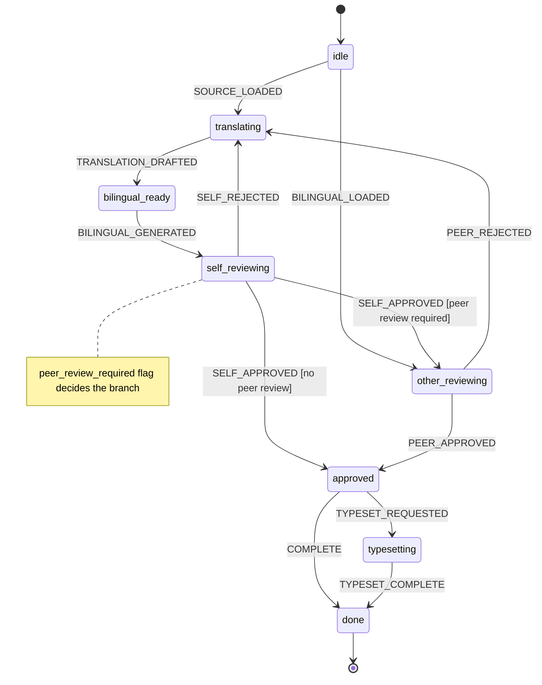

# MPI Project Conventions

## Agent Instructions

You are working on the Mindful Peace International Chinese-English Buddhist/Dharma translation project.
- Before translating, load the `mpi-translation` and `mpi-terms-search` skills.
- Before reviewing, load `mpi-translation-review` (self mode for your own translations, other mode for peer review).
- The agent IS the model: do not call external translation APIs.
- The workflow is not as rigid as the state machine below. The user may ask you to deviate from it. Be flexible when asked.

## Skills

Skills in `toolkit/skills/`.

Available: `mpi-translation`, `mpi-terms-search`, `mpi-translation-review`, `mpi-chinese-text-normalize`, `mpi-pptx-translate`, `mpi-pdf-to-docx-conversion`.

## Terms Database

See `mpi-terms-search` skill. Quick reference:
- CLI: `toolkit/terms-database/search.py <query> [limit]`
- Module: `from search import search; search("空性", limit=5, src="DoT定稿")`
- Priority: DoT定稿 > 内部特色词 > 佛教术语 > 经论名

## Directory Structure

```
translate-files/<topic>/<article>/
  source.dj      — Chinese original
  target.dj      — English translation (line count matches source)
  bilingual.dj   — interleaved (source line, blank, target line, blank)
                   Generated by `../../toolkit/scripts/gen-bilingual.py source.dj target.dj`;
                   do not edit or commit.
```

Put `.docx` output in `/tmp/`. Don't commit binaries.
Generated files (`bilingual.dj`) are not committed either.

---

## Translation State Machine

All translation work follows this deterministic workflow. Non-deterministic LLM work (drafting, reviewing) happens at the edges; the states and transitions are fixed.



States:

| State | Meaning | Output artifact |
|---|---|---|
| `idle` | Waiting for source or an existing bilingual file. | — |
| `translating` | Agent loads `mpi-translation` + `mpi-terms-search` skills and drafts `target.dj`. | `target.dj` |
| `bilingual_ready` | `bilingual.dj` generated from `source.dj` + `target.dj`. | `bilingual.dj` |
| `self_reviewing` | Self-review with unified ruleset (self mode). Edit target.dj. | `target.dj` (edited) |
| `other_reviewing` | Peer review with unified ruleset (other mode). Write review-comments.dj. | `review-comments.dj` |
| `approved` | Translation accepted. May typeset or finish. | — |
| `typesetting` | Producing PDF/DOCX from approved bilingual content. | `.pdf` / `.docx` |
| `done` | Complete. | — |

## Workflow A: Translation（翻译）

Translate Chinese source into English. The agent IS the model — no external APIs. This workflow covers the state machine path `idle` → `translating` → `bilingual_ready` → `self_reviewing`.

### Source context

Before translating, the agent must understand the source's format and delivery context. If the source is a transcript of an oral talk, a book excerpt, a guided meditation script, a Q&A, a written article, or any other genre, that register shapes the translation. If this context is not clear from the file path or source content, ask the user before proceeding.

### Input

Source text in `.dj` or `.docx` (Chinese only).

### Deliverables

- `source.dj` — extracted/cleaned Chinese
- `target.dj` — English translation, line count matches source
- `bilingual.dj` — interleaved (source line, target line adjacent, blank between pairs).
  Generated by `../../toolkit/scripts/gen-bilingual.py source.dj target.dj > bilingual.dj`.
  Do not create or edit by hand; do not commit.
- `edit-suggestions.dj` — terminology/consistency issues flagged for review

### Rules

1. Load `mpi-translation` and `mpi-terms-search` skills before starting.
2. Search terms DB for key Buddhist terms.
3. TOC: plain bullet lists, no link targets, no page numbers.
4. Djot formatting:
   - Emphasis: `*text*` (single asterisks). Never `**` (Markdown bold).
   - Comments: ``
5. Preserve source formatting — don't add/remove emphasis.
6. Translate in-response — never call external translation APIs.

### Review

After translating, load `mpi-translation-review` (self mode) to check:
- Full detection rules (three passes + R1–R14 editorial polish)
- Terminology consistency against terms DB
- Grammar, fluency, calques
- Missing content (mid-paragraph truncation)
- Inconsistency (same term translated differently)

---

## Workflow B: Proofread / Review（校对/审阅）

Both self-mode and other-mode review use the unified `mpi-translation-review` skill.
The **same detection rules** apply to both. The only difference: self mode edits
`target.dj` directly; other mode writes `review-comments.dj` with collaborative tone.

A third mode — **Direct Edit Review** — applies when the user explicitly says to
edit the `.dj` files directly and skip any comments file.

### B1: Self-Review（自审）

You translated it. You own the English. Load `mpi-translation-review` skill (self mode).

1. Read `source.dj` + `target.dj` fully.
2. Apply all detection rules (three passes + R1–R14 editorial polish).
3. Edit `target.dj` directly with `patch` (mode='replace').
4. Record non-obvious choices in `translation-findings.dj` if needed.
5. Regenerate `bilingual.dj` with `../../toolkit/scripts/gen-bilingual.py source.dj target.dj > bilingual.dj`.
6. Verify line counts: `source.dj` and `target.dj` must match.

### B2: Other-Review（审他稿）

Someone else translated it (volunteer, etc.). Load `mpi-translation-review` skill (other mode).

1. Read `source.dj` + `target.dj` fully.
2. Apply all detection rules (three passes + R1–R14 editorial polish).
3. Do NOT edit `target.dj` — write `review-comments.dj` instead.
4. Follow deliberation protocol: 随喜 first, questions not commands.
5. Address translator by name.
6. Ask the user whether to apply the findings. If yes, switch to Direct Edit Mode.

### B3: Direct Edit Review（直接修改稿）

The user wants fixes applied directly, no separate comments file. This can follow
a translation-review pass, or be a standalone polish pass.

1. Read full `target.dj` + `source.dj` in one pass.
2. Collect every issue using the full detection rules.
3. Batch all fixes into one set of exact-string replacements. Apply with `patch`.
4. Regenerate `bilingual.dj` with `../../toolkit/scripts/gen-bilingual.py source.dj target.dj > bilingual.dj`.
5. Verify line counts match.

Avoid iterative "find a few more, edit again" loops. If the user asks "anything
else?" after a direct-edit pass, do one more full systematic read and batch again.

---

## Djot

- Comments: ``
- Emphasis: `*text*` (single asterisks)
- Dashes in English: `---` em, `--` en. Pandoc converts in docx output.
- Preserve source formatting — don't add/remove emphasis

When editing `.dj` files, use `patch` (mode='replace') — not regex-based
string replacement in `execute_code`. `patch` is safer, surfaces conflicts,
and produces a diff you can review.

## Typst Bilingual Template

For producing PDFs from bilingual Chinese-English articles:

- Template: `translate-files/lib/mpi-bilingual-template.typ`
- Example host: `translate-files/从物品整理到心灵整理/mindful-organizing.typ`
- Design notes: `references/typst-template-design.md`
- Produce rendered PDF files in: /tmp/

## Scripts

Utility scripts in `toolkit/scripts/` (fish for CLI wrappers, Python for data processing).
Agents should write repetitive logic here and run via `terminal` rather than
regenerating the same Python in execute_code each turn.

- `toolkit/scripts/docx2dj.fish <docx>` — pandoc .docx → .dj alongside the original
- `toolkit/scripts/split-bilingual.fish <combined.dj>` — split into source.dj (CN) + target.dj (EN)
- `toolkit/scripts/dj2docx.fish <target.dj>` — pandoc .dj → .docx in `/tmp/`
- `toolkit/scripts/proofread-pdf.py <docx> <pdf>` — word-level diff between manuscript and typeset PDF
- `toolkit/scripts/gen-bilingual.py <source.dj> <target.dj>` — produce `bilingual.dj` on stdout; run as `gen-bilingual.py source.dj target.dj > bilingual.dj`
- `toolkit/scripts/gen-bilingual-<name>-<hash>.py` — article-specific extraction from DOCX or source/target pairing
- `toolkit/scripts/compile-typst.fish <typ>` — compile a Typst file to PDF

Article-specific scripts (including Typst compile helpers) should be placed in
the article directory itself, named with a short hash: e.g.
`translate-files/<article>/compile-typst-<hash>.fish`.
